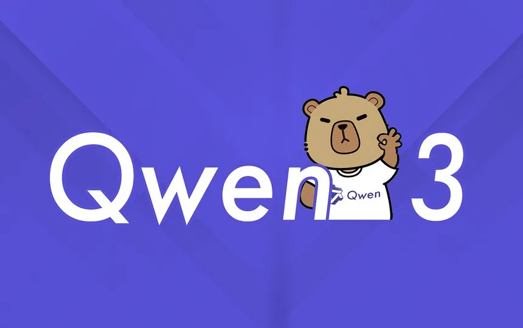

Alibaba has just released Qwen 2.5-Max, their most advanced AI model yet, and it's making waves in the AI community. This isn't just another incremental update – it represents a significant evolution in what AI can do.

<!--more-->

### What Makes Qwen 2.5-Max Special?

- **Massive Training Scale**: Built on over 20 trillion tokens of training data, giving it a knowledge base that rivals or exceeds other top models
- **Mixture-of-Experts (MoE) Architecture**: This innovative design allows the model to route different types of questions to specialized "expert" neural networks within its system
- **Benchmark-Topping Performance**: Outperforms comparable models like GPT-4, LLaMA 3.1, and DeepSeek on standard language tasks
- **Dual Input Modes**: Handles both text and images naturally, making it truly multimodal

The model has been refined through both Supervised Fine-Tuning (SFT) and Reinforcement Learning from Human Feedback (RLHF) – fancy terms that basically mean they've trained it extensively on what humans consider good responses.

### What Can You Actually Do With It?

Qwen 2.5-Max excels at:
- Creating high-quality written content
- Understanding and generating realistic image outputs
- Tackling complex reasoning challenges
- Supporting multiple languages

This makes it valuable for content creators, marketers, developers, and businesses looking to automate complex tasks or create new AI-powered products.

### How Can You Access It?

Unlike some AI models, Qwen 2.5-Max isn't open-source. You'll need to access it through:
- Alibaba Cloud services via their API
- Qwen Chat on Alibaba platforms

For those interested in other models in the Qwen family, Alibaba offers specialized versions optimized for coding and mathematics.

### What This Means for the AI Landscape

Alibaba's latest release shows how quickly AI capabilities are advancing. With each new model generation, we're seeing improved reasoning, more natural interactions, and better performance across diverse tasks.

For businesses and developers, these advancements open new possibilities for automation and innovation, while raising the bar for what users will expect from AI assistants.

<!--
### Resources & References

- **Primary Source:** https://x.com/alibaba_qwen/status/1947766835023335516?s=12
- **Additional Sources:** 
  - Alibaba Cloud Blog: https://www.alibabacloud.com/blog/qwen2-5-a-party-of-foundation-models_601782
  - GitHub Repository: https://github.com/QwenLM/Qwen
- **Key Terms/Concepts:** Mixture-of-Experts (MoE), Supervised Fine-Tuning (SFT), Reinforcement Learning from Human Feedback (RLHF)
- **Related Topics:** Large language models, multimodal AI, foundation models, AI benchmarking
-->