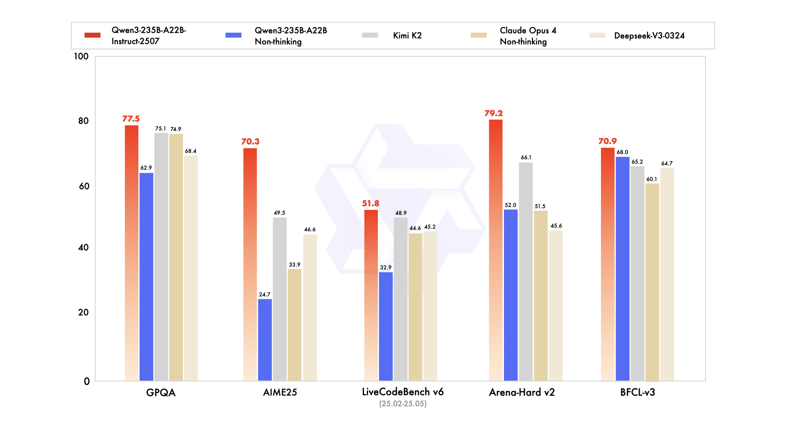

Alibaba has launched Qwen3-235B-A22B, a groundbreaking open-source large language model that's changing the game for AI accessibility. While packing a massive 235 billion parameters, it cleverly activates just 22 billion during actual use, making it both powerful and practical.

<!--more-->

### Key Features That Set It Apart

### Smart Architecture Drives Performance
The model leverages a Mixture-of-Experts (MoE) architecture that delivers top-tier performance without the typical computing costs. This means you get premium AI capabilities at roughly 1/10th the cost of comparable closed-source models like GPT-4 or Claude 3.

### Dual Processing Modes for Maximum Efficiency
What makes Qwen3 truly unique is its hybrid reasoning capability:
- **Thinking Mode**: Activates for complex tasks requiring multi-step reasoning (math, coding, logic)
- **Non-thinking Mode**: Works faster for general responses and simpler tasks

This flexibility lets you control up to 38,000 tokens in reasoning length, optimizing both intelligence and speed based on what you're asking.

### Impressive Benchmark Performance
Despite its efficient design, Qwen3-235B-A22B outperforms or matches premium models like:
- DeepSeek-R1
- Grok-3
- Gemini-2.5-Pro
- Kimi-2

### Massive Context Window
The instructed variant supports up to 256K tokens, letting you process extremely long documents and complex tasks in a single go.

### Extensive Training Foundation
The model was trained on 36 trillion tokens, including:
- Web data
- Documents
- Specialized datasets for math and programming

### Open and Accessible
The entire Qwen3 series (six dense models and two MoE models) has been open-sourced under the Apache 2.0 license, covering parameter ranges from 0.6B to 235B for different application needs.

### Why This Matters

Alibaba's approach makes frontier AI accessible to more developers and organizations. By dramatically reducing computing requirements while maintaining elite performance, Qwen3 lowers the barrier to implementing advanced AI for everything from mobile apps to enterprise systems.

For developers, this means being able to deploy state-of-the-art AI with better economics. For users, it means more powerful, responsive AI experiences across more products and services.

<!--
### Resources & References

- **Primary Source:** https://venturebeat.com/ai/alibabas-new-open-source-qwen3-235b-a22b-2507-beats-kimi-2-and-offers-low-compute-version/
- **Additional Sources:** 
  - Alibaba Cloud Press Room
  - The Decoder
  - Cerebras press release
  - TechCrunch coverage
- **Key Terms/Concepts:** Mixture-of-Experts (MoE), hybrid reasoning, parameter-efficient inference, context window
- **Related Topics:** Open-source AI models, efficient AI deployment, large language model architectures, AI democratization
-->