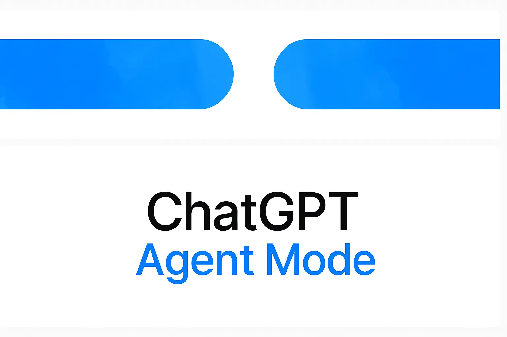

OpenAI has just introduced ChatGPT agent - their most ambitious evolution of ChatGPT that transforms the AI from just answering questions to actively completing tasks for you without constant supervision. This new general-purpose AI agent works inside its own computer environment to handle complex workflows from start to finish.

<!--more-->

### What Makes ChatGPT Agent Different

Unlike regular ChatGPT that only responds to your questions, the agent can:

- Make decisions on its own about what actions to take
- Navigate websites and digital tools independently
- Complete entire workflows without needing step-by-step instructions
- Produce finished work products like reports, presentations, and spreadsheets

It combines two powerful technologies OpenAI previously developed:
- **Operator**: Allows the AI to click through websites and interact on its own
- **Deep Research**: Helps it gather, filter, and synthesize information from multiple sources

### What You Can Ask ChatGPT Agent To Do

ChatGPT agent shines at handling tasks that would normally require multiple apps and lots of your time:

### For Work
- Review your calendar and brief you on upcoming meetings with relevant context
- Analyze competitors and create professional slide decks 
- Update complex spreadsheets while preserving all formatting
- Rearrange meetings and manage your schedule
- Generate meeting agendas and follow-ups

### For Personal Life
- Plan meals and buy ingredients (like shopping for a Japanese breakfast for four)
- Research and book travel itineraries
- Find specialists for specific needs
- Manage appointments and personal events
- Organize gatherings from concept to execution

### How You Interact With The Agent

You stay in control while the agent works. You can:
- Give instructions in plain language
- Pause the agent anytime
- Clarify instructions if needed
- Change tasks mid-action
- Let the agent work independently until completion

### Who Can Use It

As of July 17, 2025, ChatGPT agent is available to ChatGPT Pro, Plus, and Team subscribers. You can activate it by selecting "agent mode" in the ChatGPT interface.

### Why This Matters

This release signals a major shift in AI tools - moving from passive assistants that only respond when prompted to proactive agents that can handle complex tasks independently. By combining conversation ability with autonomous action, OpenAI is creating AI that delivers complete solutions rather than just information or suggestions.

For everyday users, this could mean spending less time jumping between different apps and more time focusing on work that truly matters.

### Resources & References

- **Primary Source:** https://openai.com/index/introducing-chatgpt-agent/
- **Additional Sources:** https://techcrunch.com/2025/07/17/openai-launches-a-general-purpose-agent-in-chatgpt/, https://www.ainvest.com/news/openai-chatgpt-agent-tool-enterprise-users-2507/, https://www.cxtoday.com/conversational-ai/openais-new-chatgpt-agent-will-find-communicate-with-and-buy-from-businesses/
- **Key Terms/Concepts:** AI agents, autonomous AI, operator technology, deep research
- **Related Topics:** AI productivity tools, future of work automation, AI agents vs. assistants