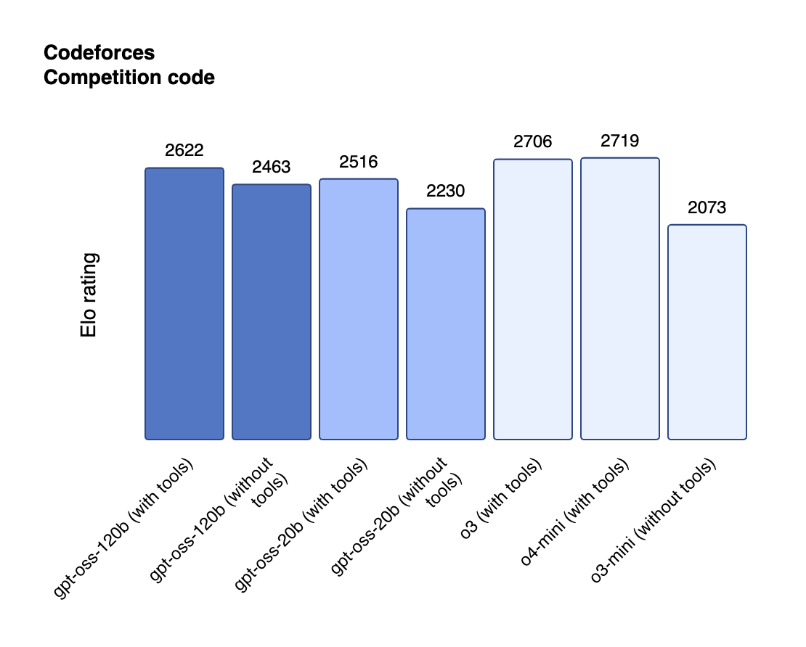

OpenAI has made a surprising return to its roots with the release of GPT-OSS, its first fully open-source large language model since GPT-2. Announced on August 5, 2025, the release includes two models: gpt-oss-120b and gpt-oss-20b, both available under the permissive Apache 2.0 license.

<!--more-->

### What Makes GPT-OSS Special?

The release marks a significant shift in OpenAI's strategy. After years of keeping models like GPT-3 and GPT-4 behind closed APIs, they're now offering state-of-the-art models that you can run entirely on your own hardware.

Key highlights include:

- **Fully Open Weights**: Download and run the models without depending on OpenAI's cloud
- **Top-Tier Performance**: Outperforms similarly-sized open models on reasoning tasks
- **Strong Tool Use Capabilities**: Built-in abilities to use external tools effectively
- **Modern Architecture**: The 120B model uses a Mixture-of-Experts design for efficiency
- **Flexible Deployment**: Run it locally or on private infrastructure with no rate limits

### Technical Innovations

OpenAI didn't just open-source existing technology. They've created something new by leveraging:

- Reinforcement learning techniques refined through their commercial models
- Insights from their advanced internal "o-series" models (including o3)
- Optimization for consumer hardware deployment without sacrificing capabilities

The focus on efficiency means you can actually use these powerful models without needing massive computational resources or cloud dependencies.

### Why This Matters

For developers, researchers, and organizations, GPT-OSS represents true AI independence:

- Complete control over your data and privacy
- No more usage fees or API rate limits
- Freedom to customize and fine-tune for specific use cases
- Transparent access to model weights and architecture

This democratizes access to advanced AI in a way we haven't seen from OpenAI in years, enabling both research applications and practical autonomous AI systems that can reason and act independently.

### Practical Applications

With GPT-OSS, you can:
- Self-host chatbots and assistants
- Build custom AI tools with your own data, entirely privately
- Deploy on platforms like Northflank with one-click templates
- Experiment with model modifications without restrictions

This release might signal a new chapter in AI accessibility, where powerful models become available to everyone, not just those willing to pay for API access.

<!--
### Resources & References

- **Primary Source:** https://openai.com/index/introducing-gpt-oss/
- **Additional Sources:** https://openai.com/index/gpt-oss-model-card/, https://northflank.com/blog/self-host-openai-gpt-oss-120b-open-source-chatgpt
- **Key Terms/Concepts:** Open-weight models, Mixture-of-Experts architecture, Self-hosting LLMs, Apache 2.0 license
- **Related Topics:** Local LLM deployment, AI democratization, Open source AI models, Model efficiency
-->